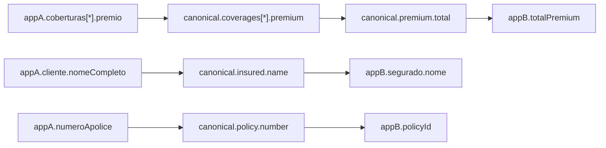
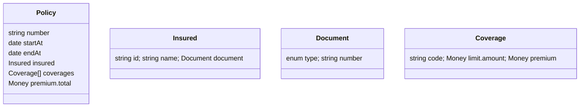

Esse cenário acontece muito quando o contrato “viaja” entre REST/Kafka e cada app fala um dialeto diferente do mesmo JSON. A boa solução combina **modelo canônico**, **mapeamentos formais** e **visualizações automatizadas**. Segue um guia direto, com ferramentas que funcionam bem na prática.

# Plano em 5 passos

1. **Inventário & esquema de fato**

* Colete *exemplares reais* de payloads por aplicação (request/response, eventos Kafka).
* Gere um **esquema** por aplicação a partir dos exemplos (para JSON, use geradores de schema).
* Saída: `schemas/<appX>.json` (JSON Schema) + exemplo(s) em `samples/`.

2. **Modelo Canônico (CDM) do domínio Seguro**

* Defina um **JSON Schema canônico** (em um único idioma — recomendo inglês) com $id e $ref para modular (ex.: `Policy`, `Insured`, `Coverages`, `Premium`).
* No dicionário de dados, inclua **aliases** para PT/EN e variações (ex.: `insured.name` tem aliases `segurado.nome`, `customer.full_name`).
* Saída: `schemas/canonical/Policy.json` e `docs/data-dictionary.md`.

3. **Especificar os mapeamentos (field-level)**

* Para cada aplicação, descreva um **mapeamento declarativo** de *source → canonical* e *canonical → target* usando **JSONPath** ou **JMESPath** (facilita tanto leitura quanto execução).
* Inclua **regras** (concatenação, split, normalização, defaults, units) e **condições**.
* Saída: `mappings/<appA>-to-canonical.yaml` e `mappings/canonical-to-<appB>.yaml`.

4. **Visualizações**

* Gere automaticamente:

  * **Matriz de mapeamento** (tabela) por fluxo.
  * **Grafo de linhagem de campos** (source fields → canonical → target fields).
  * **Diagramas da estrutura** (ER/árvore) do canônico e de cada app.

5. **Validação contínua**

* Testes que:

  * Validam exemplos dos apps contra **seus schemas** e contra o **canônico** depois da transformação.
  * Checam regras (ex.: `totalPremium == sum(coverages[].premium)`).
* Linter de contratos para manter padrões de nomes, formatos, enum, etc.

---

# Ferramentas recomendadas

## Para contrato e schemas

* **OpenAPI** (REST) + **AsyncAPI** (Kafka): documentam endpoints/tópicos e **referenciam** o JSON Schema da mensagem.
* **JSON Schema** (com `$id`, `$ref` e `definitions`) para estrutura e validações.
* **Apicurio/Confluent/Redpanda Schema Registry** (mesmo usando JSON Schema) para **versionamento** e **compatibilidade** dos eventos.

## Para inferir/girar schemas

* **genson**, **quicktype**, **datamodel-code-generator** — geram JSON Schema a partir de exemplos (boa base inicial).

## Para mapeamentos (execução e teste)

* **JSONata** ou **JMESPath**: expressivos e legíveis para *field mapping*.
* **JOLT** (Java) se quiser especificações tipo ETL (útil no ecossistema Java).
* **jq** (CLI) para prototipar transformações rápidas.

## Para visualização

* **Mermaid** (em Markdown) para grafos simples (muito prático em docs).
* **Graphviz** (DOT) para grafos grandes (gera PNG/SVG).
* **Stoplight Studio** / **Redocly** para portais de API com visualização dos schemas.
* **DataHub** ou **OpenMetadata** se quiser **linhagem de dados** mais robusta (inclusive por campo) — exige setup, mas dá visão corporativa.

---

# Modelo de diretórios (sugestão)

```
/contracts
  /schemas
    /canonical
      Policy.json
      types/
    appA.schema.json
    appB.schema.json
  /samples
    appA/
    appB/
  /mappings
    appA-to-canonical.yaml
    canonical-to-appB.yaml
/docs
  data-dictionary.md
  naming-conventions.md
  visuals/
    policy-structure.mmd
    lineage-policy.svg
/tests
  test_mappings.py  (ou Java/JUnit)
  fixtures/
```

---

# Template de **mapeamento** (YAML)

```yaml
meta:
  source: appA
  target: canonical.Policy
  version: 1.3.0
  notes: >
    appA envia "cliente" em PT; normalizamos para "insured".
rules:
  - when: "$.cliente"            # condição opcional (JSONPath/JMESPath)
    map:
      "insured.id": "$.cliente.id"
      "insured.name": "$.cliente.nomeCompleto"
      "insured.document.type": "'CPF'"           # literal
      "insured.document.number": "$.cliente.cpf"
      "policy.number": "$.numeroApolice"
      "policy.startAt": "normalizeDate($.vigencia.inicio)"  # função utilitária
      "policy.endAt":   "normalizeDate($.vigencia.fim)"
      "premium.total":  "sum($.coberturas[*].premio)"       # agregação
      "coverages[*]":
        from: "$.coberturas[*]"
        map:
          "code": "$.codigo"
          "limit.amount": "$.limite"
          "premium": "$.premio"
aliases:
  insured.name:
    - "cliente.nome"
    - "segurado.nome"
conformance:
  must:
    - "premium.total == sum(coverages[*].premium)"
    - "policy.endAt > policy.startAt"
```

> Esse YAML serve **tanto** como documentação legível quanto entrada para um runner (Python/Node/Java) que aplica as regras (via JSONata/JMESPath/JOLT) e roda testes.

---

# Visualizações rápidas

## 1) Grafo de linhagem (Mermaid)



## 2) Estrutura (árvore) do canônico



---

# Como manter tudo saudável

* **Padrões de nomenclatura**: snake_case ou camelCase, nunca misturar; documento em `naming-conventions.md` e **linter (Spectral)** para OpenAPI/AsyncAPI/JSON Schema.
* **Versionamento de schema**: `$id` com semver; migrações documentadas (CHANGELOG por contrato).
* **Testes de contrato**: para cada exemplo de cada app, rodar pipeline: `validate(source) → transform → validate(canonical)`.
* **Portal de contratos**: gere um site (ex.: Docusaurus/Redocly) que lê `/schemas`, `/mappings`, e **renderiza** Mermaid + tabelas (CI publica em GitHub Pages).
* **Schema Registry** nos tópicos Kafka para evitar “drift” silencioso.

---

# Se quiser, eu já te entrego um “starter kit”

Posso gerar um repositório base com:

* pastas acima,
* scripts para **inferir schema**, **validar e transformar** (Node/Python),
* **runner** de mapeamento com JSONata/JMESPath,
* pipeline de CI (GitHub Actions) que valida todos os exemplos,
* site estático com Mermaid e tabela de mapeamentos.

Se curtir, me diga: *linguagem preferida para o runner (Node ou Python)* e nomes reais de 2–3 campos, que eu já deixo um exemplo concreto do seu domínio (Seguro Empresarial) pronto pra você adaptar.
