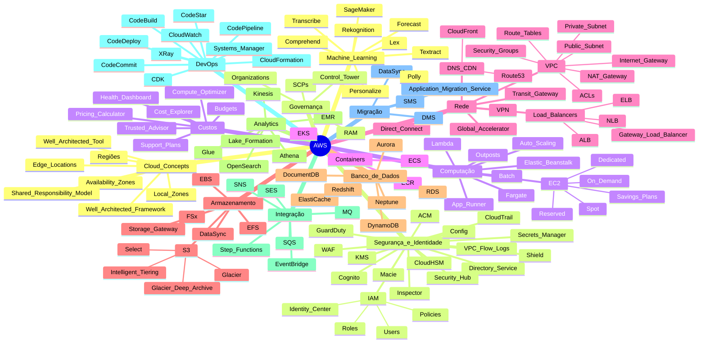

Uma forma útil é agrupar por domínio/serviço da AWS (governança, segurança, IA, armazenamento, rede, computação, etc.). Também removi duplicados (ex.: CloudFormation, Systems Manager, Cognito, Connect aparecem mais de uma vez).

# Governança, organizações e boas práticas

* AWS Control Tower
* AWS Organizations
* políticas de controle de serviço (SCPs)
* AWS Well-Architected Framework
* AWS Well-Architected Tool
* AWS Trusted Advisor
* AWS Health Dashboard
* AWS Artifact
* AWS Resource Access Manager (AWS RAM)
* AWS Shared Responsibility Model

---

# Custos e otimização

* AWS Cost Explorer
* AWS Pricing Calculator
* AWS Budgets
* AWS Compute Optimizer

---

# Segurança, identidade e conformidade

* Amazon Macie
* AWS CloudTrail
* AWS Shield
* AWS Config
* AWS Security Hub
* AWS CloudHSM
* AWS Certificate Manager (ACM)
* Amazon Cognito
* AWS Directory Service

---

# Monitoramento, gerenciamento e operações

* AWS Systems Manager
* AWS Auto Scaling
* AWS License Manager

---

# Computação (Compute)

* AWS Elastic Beanstalk
* AWS App Runner
* AWS Fargate
* AWS Outposts

### Tipos de instâncias EC2

* Dedicated Hosts
* Dedicated Instances
* Spot Instances
* Reserved Instances

---

# Containers

* Amazon Elastic Container Registry (Amazon ECR)

---

# Rede e conectividade

### Infraestrutura AWS

* Região
* Zonas de Disponibilidade

### Balanceamento de carga

* Elastic Load Balancing
* Application Load Balancer (ALB)
* Network Load Balancer (NLB)
* AWS OpsWorks Load Balancer
* Load Balancer personalizado no Amazon EC2

### Rede privada e conectividade

* AWS Direct Connect
* AWS Global Accelerator
* ACLs de sub-rede VPC
* VPC Flow Logs

---

# Armazenamento

### Armazenamento em bloco/arquivos

* Amazon Elastic Block Store (Amazon EBS)
* Amazon Elastic File System (Amazon EFS)
* Amazon FSx

### Armazenamento híbrido

* AWS Storage Gateway

### Recursos S3

* Amazon S3 Intelligent-Tiering
* Amazon S3 Select

---

# Bancos de dados e Analytics

### Analytics / Big Data

* Amazon EMR
* Amazon Redshift

### Banco de dados

* Amazon Neptune

---

# Mensageria e integração

* Simple Queue Service (Amazon SQS)
* Amazon Simple Notification Service (Amazon SNS)
* Amazon Simple Email Service (Amazon SES)

---

# Inteligência Artificial e Machine Learning

### Serviços de IA prontos

* Amazon Personalize
* Amazon Forecast
* Amazon Rekognition
* Amazon Transcribe
* Amazon Textract
* Amazon Comprehend

### Plataforma ML

* Amazon SageMaker

---

# End User Computing / Workspace

* Amazon Workspaces
* Amazon Connect

---

# Migração

* AWS Server Migration Service (AWS SMS)

---

# DevOps e desenvolvimento

* AWS CodeStar
* AWS CloudFormation

---

# Mídia

* Amazon Elastic Transcoder

---

# IoT / Hardware / Edge

* AWS Ground Station
* AWS Device Farm

---

# Treinamento e aprendizado

* Treinamento em Sala de Aula da AWS
* AWS Online Tech Talks

---

# Não identificado / provavelmente incorreto ou pouco comum

* Amazon Upstream 2.0

Esse item não corresponde a um serviço AWS conhecido atualmente. Pode haver erro de nome ou confusão com outro serviço.

Se o objetivo for estudar para certificação (ex.: Cloud Practitioner, Solutions Architect Associate), eu reorganizaria pelos domínios oficiais da prova.

---

# by cert sessions

Sim. Para estudo de certificações AWS, principalmente AWS Certified Cloud Practitioner e AWS Certified Solutions Architect – Associate, faz mais sentido agrupar pelos domínios cobrados nas provas.

# 1. Cloud Concepts

Infraestrutura:

* Região
* Zonas de Disponibilidade
* Edge Locations
* Local Zones

Modelos:

* AWS Shared Responsibility Model
* AWS Well-Architected Framework
* AWS Well-Architected Tool

---

# 2. Segurança e Identidade

Identidade e acesso:

* AWS IAM
* IAM Roles
* IAM Policies
* IAM Identity Center (antigo AWS SSO)
* Amazon Cognito
* AWS Directory Service

Segurança:

* Amazon Macie
* AWS Shield
* AWS WAF
* AWS CloudHSM
* AWS KMS
* AWS Secrets Manager
* AWS Security Hub
* AWS Certificate Manager (ACM)
* Amazon GuardDuty
* Amazon Inspector
* AWS Detective

Auditoria:

* AWS CloudTrail
* AWS Config
* VPC Flow Logs

---

# 3. Computação

Servidores:

* Amazon EC2
* AWS Elastic Beanstalk
* AWS App Runner
* AWS Fargate
* AWS Lambda
* AWS Auto Scaling
* AWS Batch
* AWS Outposts

Tipos EC2:

* On-demand
* Spot Instances
* Reserved Instances
* Savings Plans
* Dedicated Hosts
* Dedicated Instances

---

# 4. Containers

* Amazon Elastic Container Registry (ECR)
* Amazon Elastic Container Service (ECS)
* Amazon Elastic Kubernetes Service (EKS)

---

# 5. Rede

Balanceamento:

* Elastic Load Balancing (ELB)
* Application Load Balancer (ALB)
* Network Load Balancer (NLB)
* Gateway Load Balancer

Rede privada:

* Amazon VPC
* Subnets públicas
* Subnets privadas
* Internet Gateway
* NAT Gateway
* Route Tables
* Security Groups
* ACLs de sub-rede VPC
* AWS Direct Connect
* AWS VPN
* AWS Transit Gateway
* AWS Global Accelerator

DNS e CDN:

* Amazon Route 53
* Amazon CloudFront

---

# 6. Armazenamento

Objetos:

* Amazon S3
* Amazon S3 Glacier
* Amazon S3 Glacier Deep Archive
* Amazon S3 Intelligent-Tiering
* Amazon S3 Select

Arquivos:

* Amazon EFS
* Amazon FSx

Blocos:

* Amazon EBS

Híbrido:

* AWS Storage Gateway
* AWS DataSync

---

# 7. Bancos de Dados

Relacionais:

* Amazon RDS
* Amazon Aurora

NoSQL:

* Amazon DynamoDB
* Amazon DocumentDB

Grafos:

* Amazon Neptune

Data warehouse:

* Amazon Redshift

Cache:

* Amazon ElastiCache

---

# 8. Analytics e Big Data

* Amazon EMR
* AWS Glue
* Amazon Athena
* Amazon Kinesis
* AWS Lake Formation
* Amazon OpenSearch Service

---

# 9. Integração e Mensageria

Mensageria:

* Amazon SQS
* Amazon SNS
* Amazon MQ

Integração:

* AWS Step Functions
* Amazon EventBridge
* Amazon SES

---

# 10. DevOps e Desenvolvimento

Infraestrutura:

* AWS CloudFormation
* AWS CDK

Pipeline:

* AWS CodeCommit
* AWS CodeBuild
* AWS CodeDeploy
* AWS CodePipeline
* AWS CodeStar

Operações:

* AWS Systems Manager

Monitoramento:

* Amazon CloudWatch
* AWS X-Ray

---

# 11. Migração

* AWS Application Migration Service (MGN)
* AWS Server Migration Service (SMS)
* AWS Database Migration Service (DMS)
* AWS DataSync

---

# 12. Machine Learning e IA

IA pronta:

* Amazon Rekognition
* Amazon Transcribe
* Amazon Textract
* Amazon Comprehend
* Amazon Personalize
* Amazon Forecast
* Amazon Polly
* Amazon Lex

Plataforma ML:

* Amazon SageMaker

---

# 13. Governança Multi-conta

* AWS Organizations
* SCPs
* AWS Control Tower
* AWS Resource Access Manager (RAM)

---

# 14. Custos e Suporte

Custos:

* AWS Cost Explorer
* AWS Budgets
* AWS Pricing Calculator
* AWS Compute Optimizer

Suporte:

* AWS Health Dashboard
* AWS Trusted Advisor
* AWS Support Plans

---

# Prioridade muito alta para certificações

Se tivesse que reduzir tudo para os serviços mais cobrados:

**Fundação**

* IAM
* EC2
* S3
* VPC
* RDS
* DynamoDB
* Route53
* CloudFront
* Lambda
* CloudFormation

**Integração**

* SQS
* SNS
* EventBridge

**Segurança**

* KMS
* CloudTrail
* Shield
* WAF
* Secrets Manager

**Containers**

* ECS
* EKS
* Fargate

**Custos**

* Cost Explorer
* Budgets
* Trusted Advisor

**Arquitetura**

* Auto Scaling
* ELB
* Aurora
* CloudWatch

Essa lista cobre grande parte do que aparece repetidamente em Cloud Practitioner e Solutions Architect Associate.

