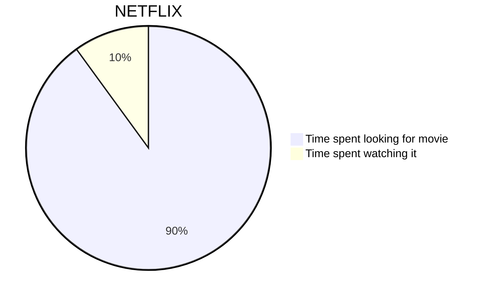
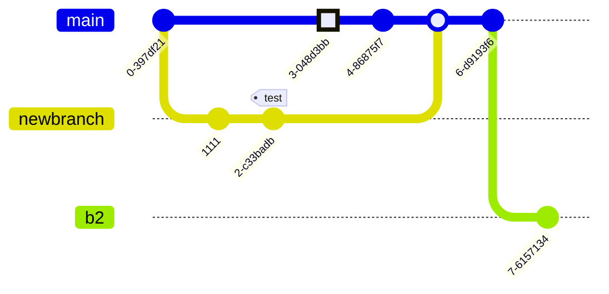

# EXAMPLE.md

## Project 

Java, Spring, Gradle (Kotlin DSL). **REST API** with PostgreSQL (JPA/Hibernate) and Kafka, ~~bla~~.

```
src/main/kotlin/com/empresa/app/
├── order/
│   ├── Order.kt                    # JPA entity = domain object
│   ├── OrderStatus.kt              # domain enum
├── user/
│   └── ...
├── shared/
│   ├── exception/
└── Application.kt
```

---



---



---


---


---

<div align="center">

[](https://github.com/fastify/fastify/actions/workflows/ci.yml)
[](https://github.com/fastify/fastify/actions/workflows/package-manager-ci.yml)
[](https://github.com/fastify/fastify/actions/workflows/website.yml)
[](https://snyk.io/test/github/fastify/fastify)
[](https://coveralls.io/github/fastify/fastify?branch=main)
[](https://standardjs.com/)

</div>

---

## Table of Contents
<!-- AUTO-GENERATED-CONTENT:START (TOC:collapse=true&collapseText="Click to expand") -->
<details>
<summary>"Click to expand"</summary>

- [Why markdown?](#why-markdown)
- [Markdown basics](#markdown-basics)
- [Advanced Formatting tips](#advanced-formatting-tips)
  - [`left` alignment](#left-alignment)
  - [`right` alignment](#right-alignment)
  - [`center` alignment example](#center-alignment-example)
  - [`collapse` Sections](#collapse-sections)
  - [`additional links`](#additional-links)
  - [Badges](#badges)
- [Useful packages](#useful-packages)
- [Useful utilities](#useful-utilities)
- [How Serverless uses markdown](#how-serverless-uses-markdown)
  - [DEMO](#demo)
- [Other Markdown Resources](#other-markdown-resources)

</details>
<!-- AUTO-GENERATED-CONTENT:END -->

--- 


> [!NOTE]  
> Highlights information that users should take into account, even when skimming.

> [!TIP]
> Optional information to help a user be more successful.

> [!IMPORTANT]  
> Crucial information necessary for users to succeed.

--- 

JPA entities use `class` (not `data class`) with mutable `var` properties, because Hibernate requires it. Mark default constructor with `protected` for JPA:

```kotlin
@Entity
@Table(name = "orders")
class Order(
    @Id val id: String = UUID.randomUUID().toString(),
    var status: OrderStatus = OrderStatus.PENDING,
    val userId: String,
    val total: BigDecimal,
)
```

---
